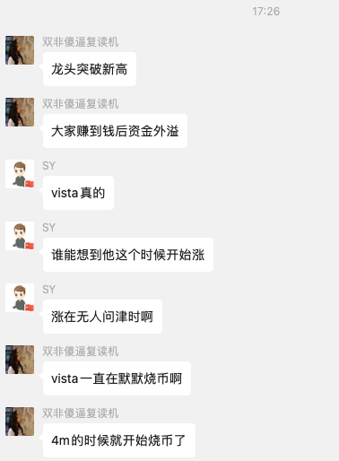

## 2024.10.28.  今日持仓

1.fxn  这个是币圈赚钱的项目，利用数学公式，进行把一种资产的两种性质进行分割，风险的只拿风险的，稳定只拿稳定的，每一周都赚钱，

2. 持仓 sui 上的河马，原因有2.  
   1. 公链的龙头发展，利用meme. 带来流量，带来交易量，推动本币的上涨。
   2. 信任的传递，你信任的人购买了，所以你也上车了，
3. 持仓sol. Eye 这只土狗，持仓原因，被人喊上车的，自己感觉k 线也没有什么问题，翻倍出本赚了， 但是自己fomo, 导致自己的操作变形。

复盘；

1. sol 土狗你是一个交易者，不能holder, 不要fomo ,前几天跟语音的打狗社区进行打土狗，打了3天，土狗没有赚钱，自己在这个环境中，真的是太fomo 了，不断的听到周边的人，说自己赚了多少，导致自己的情绪不断的上头。## 解决方案，就是不去参见语音的打狗，这就是最简单的解决方案，
2. sui  上的持仓，自己在河马最fomo 的时候，自己没有卖出，当时以为可以上到200m, 导致现在是亏损的状态， ## 解决方案，自己是在做交易，这个位置是否合适，或者说，你是否做好的计划，如何买卖。在低位的时候自己不去卖出，就是等待，或者
3. Fxn  这个没有什么问题， 只是现在的行情非常差，

 ##  2024.10.28 

情绪指标： 群友是否给你传销，这个可以到多少，有多少人相信了这件事，利用这个指标，进行判断，就是所谓的顶，还有一个指标，就是自己是否在fomo ,如果自己在fomo ,说明就是顶部。

## 2024/10/29

还是eye 影响自己的情绪，大多数都是情绪，我对于自己更加了解了，自己认为关注500个推特的，梳理出，比较简单，但是实际操作中个，发现不是很容易，： 大多数人都是对于自己是高估的状态，

昨天按照信号冲了几次土狗，发现自己还亏了，

还有这几次的30m 的狗都是外部的世界，外部的力量，你无法提前预知的，还有群友所说的，卖飞，如何办，什么样的策略可以帮助你，外部的技术非常多，但是你内心的情绪这件事情如何做，这是比较难的一件事情，所以说，你只需要让你的内心感受到平静就可以了，

## 2024/10/30

今天已经把 eye 卖掉了，这次真的学会了，翻倍出本不是什么消息你都想要买，什么标的你都在买。你只能赚你认知内的钱，30分钟你的资金翻一倍，这件事情你怎么还不知足呢，这是一件-- 需要不断的修行的能力，不是所有的消息你都需要上的，一个月上几个就可以了，-----你 进入的付费群的消息你一定要认真的观看，这是你花钱买来的，这件事情你都不认真，那什么事情你会认真呢；   你如果对你群里推荐的标的进行做表格统计，你就会发现它的胜率怎么样，自己也不会在这里总是叽叽歪歪的，所以你需要怎么办，尤其是，群里的大佬，实名大金额的购买这个时候，你都不买，那么你在想什么呢；

我电报的消息，尤其是语音打狗的群，这个群的危害非常大，因为旁边人不断的买入，麻了，这种话来刺激你，所以你现在的做法就是，不去这个频道，

1. 还有就是怕麻烦这件事情，就是你炒币不能怕麻烦，

2. 大多数的机会总是，少数人看到的，所以你需要不怕麻烦。

3. 你要对你群的信息认真认真的做总结，

   池鱼喊的。好像就是群友的购买然后把价格推高，所以你需要把大多书的钱走掉，剩下20%的钱，多数代币都是冲高回落的，所以你不要那么 BONZI 

   

复盘： 你在sol 上的pvp, 你是不可能p 赢的，你大概冲土狗，冲了好久，但是你的成功概率非常低，你什么样的项目赚的钱，你自己要清楚，你大多数赚的都是信息的钱。

> 还有一件事情，大多的代币都是交易，交易就需要有交易的纪律，像 sui 上的 河马 ，已经开始亏钱了，你就应该走了，然后换成稳定币，这是你需要做，市场一直在反复，有些标的，如果你拿的特别低的筹码，你可以一直拿着，但是如果不是这种，你拿着不卖的逻辑是什么，所以这是不对，

你需要重新梳理自己的交易逻辑，对于不同的币，进行分析，为什么会出现问题，大多数的时间，你需要如何收集信息，作出决定，小部分时间你是在做交易，这件事情你要理解，

今日持仓； 

f x n.   未来的操作逻辑，月底发布第二版白皮书，这个时候，是否会出现，币价上涨这件事，如果出现，我机会跑路，这件事，

sui. 上的河马， 这个，我找个机会，就会离开，看看是否可以回到你的成本线，这件事情，

base 上的 NORMILIO https://x.com/normiladymaker/status/1851356881475801199

购买逻辑，就是邪教组织，nft 的更换， 横盘时间很久，下跌的概率很小，： 等；先看5m 是否能达到，然后在说。

https://www.normilio.com/

具体步骤： 在你买入的时候，你就挂好单，最好挂两个单，避免无法成交。

如何：

控制睡觉的时间，按照群里热闹程度，如果大部分

你是一个交易者的心态来，进行购买的，如果价格下架10% ，你需要离开，翻倍出本，或者有一定的利润就要离开这就是你的策略。 

不知道为什么，

不知道自己怎么想的，有病，你亏了你还不离开，你在想什么，想吃💩吗，赚钱你不走，你在想什么，真是有病的人，

真是有病，

有多少次的机会你可以卖出，你都不买，总是被大家fomo ,这件事情，事完全不对的。无论哪个群里都是这件事 ，你不能被fomo ,

自我检查清单：

1. 买入之前是否要知道，自己只需要翻倍，或者3倍一定离开哦
2. 群里的大家是否在fo mo 
3. 赚钱的第一件事，是什么，是出金，这件事呢
4. 一定要记住，
5. 是否有人推特喊单，是否有人开space 
6. 

# 20241031

币圈赚钱方法： 

购买btc. 跟着 咖啡哥，或者在恐惧贪婪数字比较低的时候，购买btc  在阶段性的高点卖掉。

新闻热点炒币： 土狗

平时：

币安新上市的代币，你可以关注监控币安接口的新闻平台， 在上币的那一刻进行购买，然后半小时后卖出，

币安下架的币； 你可以进行做空，

还有最近上线的土狗代币，大热的土狗代币，如果热度一过去，可以适量的进行做空，

代币解锁： 这个也可以进行适量的做空，

交易所要开一个链： 链上的dex。去中心化交易所可以购买，

公链上面开始跑meme:  公链本身的代币可以赚钱，公链上面的meme 龙头也可赚钱，切记；及时跑

挖矿：把币存在年化比较高池子中，赚 apr 

吃利息： 把币存在交易所，或者把稳定币，存在交易所吃利息

大选：大选之前购买与大选有关的标的，大选之后，卖出，

邪教币： 推特或者nft 或者现实世界中的小众人群，他们的nft 他们的币需要参与

币安上市的二级代币： 长期的交易量比较低，但是推特活跃，机构众多，还有拯救的机会，这样的币，提前买一些，

