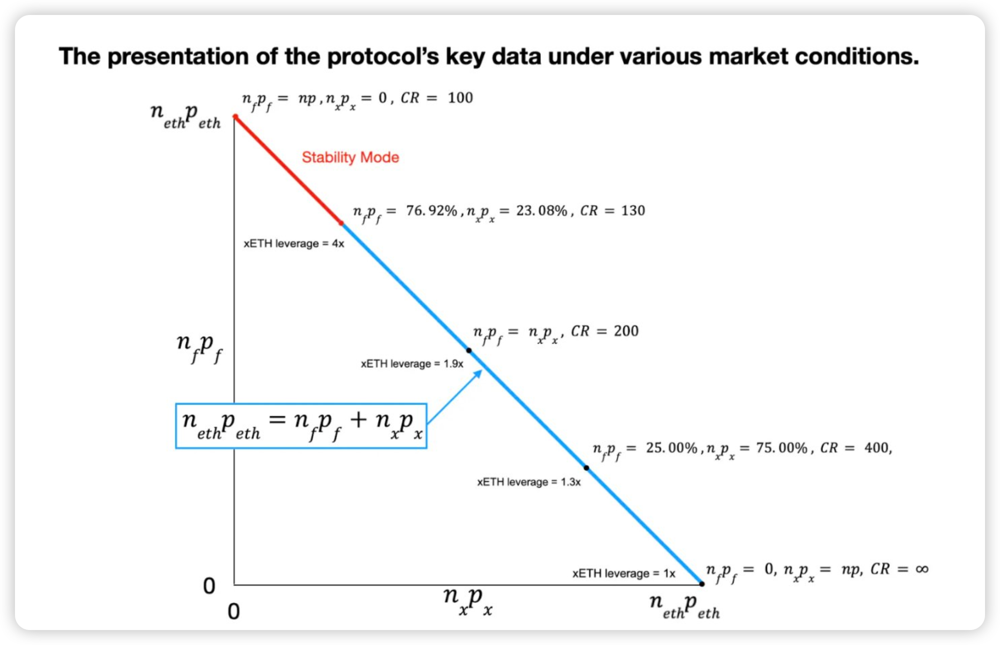
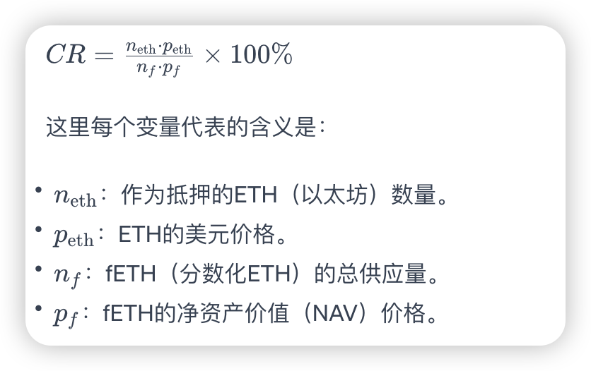
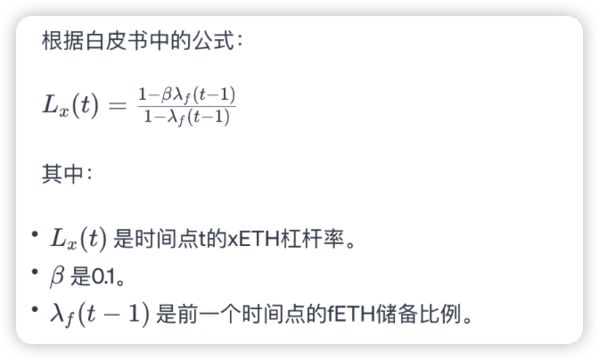
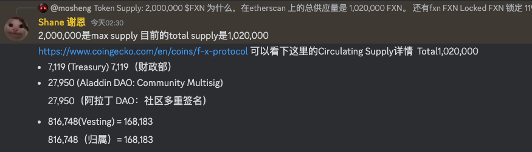
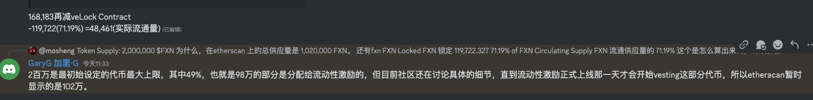
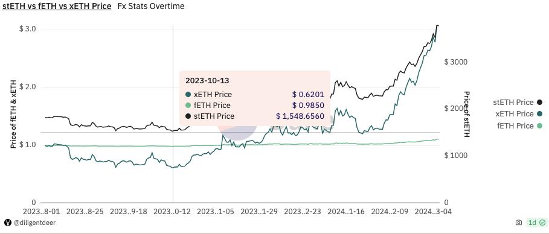
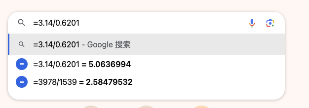
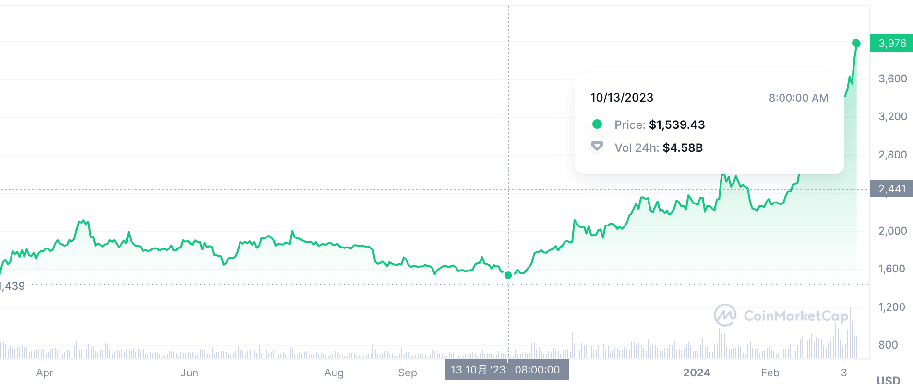
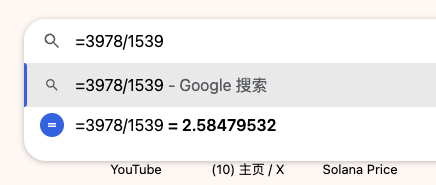

### 视频资料

1. [fx 项目如何理解](https://www.youtube.com/watch?v=CVvDw3mwzps)
2. 

### 推特

1. [@taowang1](https://twitter.com/taowang1)   这个人最早推文，就是这个日期，大部分都是defi  相关的。[2021年11月29日](https://twitter.com/taowang1/status/1465110866966106112)

### 其他资料

1. [脱钩风险](https://cryptorisks.substack.com/p/asset-risk-assessment-xeth-and-feth?r=24gor&utm_campaign=post&utm_medium=web)
2. [官方文档](https://docs.aladdin.club/f-x-protocol/tokenomics)

- https://medium.com/@protocol_fx_667/f-x-protocols-tokenomics-offer-a-calculated-journey-towards-success-b97487df41b9
- https://twitter.com/taowang1
- https://fx.aladdin.club/home/
- https://snapshot.org/#/arbitrumfoundation.eth
- https://github.com/AladdinDAO/aladdin-v3-contracts/blob/main/audit-reports/SECBIT_Concentrator_asdCRV_Update_Report_v1.0_20231228.pdf
- https://medium.com/@protocol_fx_667/fxusd-this-aint-your-bank-s-stablecoin-7d6a717af488
- https://docs.aladdin.club/f-x-protocol/vefxn-and-revenue-distribution
- https://docs.aladdin.club/f-x-protocol/useful-links
- https://github.com/AladdinDAO/aladdin-v3-contracts/blob/main/whitepapers/f(x)_whitepaper_v2.pdf

#### 代币价值

+ 74%的代币被锁定。

  

### 白皮书理解

白皮书中，抵押率（CR）的计算方式如下：

CR用百分比表示，用于衡量协议的整体健康状况。它代表了以ETH计的抵押物总价值与fETH净资产价值的比率。系统正常运作，CR必须超过100%，这意味着抵押物的价值必须超过债务的价值（在这个情况下是fETH）。

如果CR降到100%，这将意味着xETH（杠杆ETH）的净资产价值将为零，这对协议来说将是一个临界状态。因此，该协议旨在维持CR在130%以上，以确保稳定性，并防止ETH价格的大幅下跌，否则可能会破坏系统稳定。

白皮书概述了如果CR下降到某些阈值以下，管理风险和确保系统稳定性的措施。这些措施包括铸币和赎回控制，以及一个再平衡池，以帮助维持CR在100%以上，防止系统变得不稳定。

1. CR=130  ,是一个统计学的上的数据，这里先不做研究，feth 的波动率是eth 波动率的10% 。这个是已知的，

2. 图中的CR如果确定，xeth 的杠杆随之确定，

3. 

4. 先说4倍杠杆的情况，xeth 的杠杆为4 倍时。为什么，nfpf =76.92% ，nfpf为76.92%，nxpx为23.08% ，因为满足CR=130 ，np|nfpf=130 , 所以 nfpf为76.92%，nxpx为23.08% 。 

5. 所谓的衍生资产就是，预期， 就是对于代币未来的预期，你认为未来会涨，你就可以购买期权，期货，合约，进行扩大自己的收益。

   

+ 四倍杠杆这个位置是如何实现的，因为你加了杠杆，所以导致，变化都是4倍的变化。

+ 因为xETH的杠杆是4倍，所以ETH价格10%的下降将导致xETH的NAV下降40%。 

  

2024年01月27日18:42:35 ，今天拍了一个视频讲解 fxn  

### 2024年02月03日14:15:05

+ 代币经济学，

+ f(x) 代币分配

  代币名称：f(x)协议代币

  代币符号：FXN

  代币供应：2,000,000 $FXN  200万

https://new.qq.com/rain/a/20230908A07ID600

FXN Locked

## 119,722.327  锁了11万，

71.19% of FXN Circulating Supply      

### 按照上面的算，现在流动了，或者叫做解锁，168172  总流通16万，。

https://etherscan.io/token/0x365accfca291e7d3914637abf1f7635db165bb09#balances

这个可以帮助你查看，fxn 的合约，holder  等等

coinmarkcap[ 可以帮你查看，转账的次数，转账的金额]

https://dune.com/diligentdeer/fx-protocol

Token Supply: 2,000,000 $FXN   为什么，在etherscan  上的总供应量是 1,020,000 FXN。 还有fxn  
FXN Locked FXN 锁定

119,722.327
71.19% of FXN Circulating Supply
FXN 流通供应量的 71.19%      这个是怎么算出来的，麻烦解答

****

Total.    1,020,000  102万

Aladdin DAO: Community Multisig) 27950  2万

锁在协议里面投票的：119,722.327   11万

Vesting   816,748   81万

国库储备：7000，

| **Rank** | **Address**                    | **Quantity**               | **Percentage** | **Analytics** |
| -------- | ------------------------------ | -------------------------- | -------------- | ------------- |
| **1**    | Vesting                        | 816,748.730047177000000000 | 80.0734%       |               |
| **2**    | Voting Escrow                  | 119,751.895617255000000000 | 11.7404%       |               |
| **3**    | AladdinDAO: Community Multisig | 27,950.332952815800000000  | 2.7402%        |               |
| **4**    | Vyper_contract                 | 9,775.077929972130000000   | 0.9583%        |               |
| **5**    | AladdinDAO: f(x) Treasury      | 7,119.915946328540000000   | 0.6980%        |               |
| **6**    | 'Curve.f...xn/Fxn              | 2,017.466245612880000000   | 0.1978%        |               |
| **7**    | 0x56B3c8...26B82b91            | 1,397.713230953080000000   | 0.1370%        |               |
| **8**    | Curve.f... sdFXN"              | 1,268.195211448200000000   | 0.1243%        |               |
| **9**    | 0x3dC606...8E018958            | 1,234.299332707830000000   | 0.1210%        |               |
| **10**   | precompute.eth                 | 1,133.661256076560000000   | 0.1111%        |               |
| **11**   | 0xe0d102...cf9c9636            | 1,132.583240220400000000   | 0.1110%        |               |
| **12**   | 0x0D460F...8AbFc5a1            | 1,002.164732743590000000   | 0.0983%        |               |
| **13**   | 7bfee.eth                      | 1,000.00089839490000000    | 0.0980%        |               |
| **14**   | 0xa32207...77e426fe            | 930.838514779692000000     | 0.0913%        |               |
| **15**   | 0x5B3f05...86b4Dbe9            | 849.592203330667000000     | 0.0833%        |               |

****

https://www.coingecko.com/en/coins/f-x-protocol 可以看下这里的Circulating Supply详情  Total1,020,000
- https://www.coingecko.com/en/coins/f-x-protocol 可以看下这里的Circulating Supply详情  Total1,020,000
  - 7,119 (Treasury) 
  - 27,950 (Aladdin DAO: Community Multisig)
  - 816,748(Vesting) = 168,183

### 2024年02月13日15:26:08

+ fxUSD是一个基于f(x)协议的去中心化稳定币系统，它使用一种创新的稳定-杠杆对机制来创建和管理其价值。下面是这个机制的简化解释：

  ### 1. **稳定-杠杆对的基本概念：**

  - **基础代币（如stETH）作为储备：** f(x)协议持有某些基础代币（例如stETH）作为储备。
  - **衍生代币的创建：** 针对这些储备，协议会铸造两种类型的衍生代币：一个稳定代币和一个波动代币。稳定代币的价值固定等于1美元，而波动代币的价值则根据基础代币的市场价值变动。

  ### 2. **再平衡池：**

  - **收益和风险管理：** 用户可以将稳定代币存入再平衡池，从而赚取基于储备资产收益的分成（如stETH的质押收益）。这样做同时承担一定风险，因为如果稳定代币和波动代币之间的价值失衡，系统可能会自动调整，以保持整体系统的稳定性。

  ### 3. **fxUSD的创建和支撑：**

  - **由稳定代币支撑的fxUSD：** fxUSD由所有接受的稳定-杠杆对中的稳定代币1:1支撑。用户可以通过向系统提供接受的基础代币（如stETH）或从再平衡池提取稳定代币来铸造fxUSD。
  - **流动性和可兑换性：** fxUSD旨在提供即时的铸造和赎回能力，无滑点，并且不需要额外的流动性池。这意味着用户可以随时将fxUSD兑换回等价值的基础代币。

  ### 4. **风险管理：**

  - **存款上限和风险控制：** 为了管理风险，协议会为每种基础代币设定存款上限，以及它们可以为fxUSD支撑贡献的总价值上限。

  ### 5. **增强流动性和用户体验：**

  - **“流动性之泉”和Zaps：** f(x)协议通过提供给基础代币额外的流动性服务（如FXN代币的额外奖励）来增加其吸引力，从而自然增加fxUSD的可用流动性。此外，Zaps功能简化了用户的体验，使得直接从ETH或其他基础代币进入和退出fxUSD变得简单无痛。

  总的来说，fxUSD利用稳定-杠杆对机制和再平衡池来创建一个去中心化、可扩展且用户友好的稳定币，旨在提供强大的价格稳定性、内置收益率和简化的用户体验。

  

  

  fxUSD  有什么用，为什么要设计

  

  fxUSD的设计和用途围绕几个关键目标展开，这些目标旨在解决现有加密货币市场中的一些挑战，同时提供独特的价值和功能。以下是fxUSD的主要用途和设计背后的原因：

  ### 为什么设计fxUSD？

  1. **提供去中心化稳定币：** 在加密货币领域，稳定币是极其重要的工具，用于降低交易和持有资产的波动风险。然而，市场上许多稳定币都依赖于中心化的发行机构和资产作为支撑。fxUSD的设计旨在提供一个完全去中心化的稳定币选项，其价值稳定性不依赖于任何中心化实体。
  2. **内置收益：** 通过利用再平衡池和稳定-杠杆对机制，fxUSD为持有者提供了一种内置的收益获取方式，即通过质押和其他去中心化金融(DeFi)活动来赚取收益。
  3. **提升流动性和可兑换性：** fxUSD通过其独特的设计，使用户能够即时铸造和赎回稳定币，无需担心滑点或流动性不足的问题。这提高了资金的流动性，为用户提供了更高的灵活性。

  ### fxUSD的用途：

  1. **交易媒介：** fxUSD作为一种稳定的价值储存手段，可以在交易平台上用于买卖其他加密资产，减少价格波动的影响。
  2. **价值存储：** 对于希望避免加密市场波动性的用户，fxUSD提供了一个稳定的价值存储方式。
  3. **去中心化金融（DeFi）活动：** fxUSD可以用于各种DeFi协议和平台，包括借贷、流动性挖矿和收益农场，作为一种稳定且可靠的资本。
  4. **跨链操作：** 作为一个去中心化稳定币，fxUSD有潜力被用于跨链操作，促进不同区块链生态系统之间的价值转移。
  5. **支付和结算：** 在长期的视角中，fxUSD也可以作为支付和结算的手段，为用户提供一种去中心化、稳定和安全的支付选项。

  综上所述，fxUSD的设计和用途旨在为加密货币市场提供一个去中心化、内置收益、高流动性和可兑换性的稳定币解决方案，同时通过其独特的经济模型和技术框架为DeFi生态系统增加价值。

@handle_fi

https://coinmarketcap.com/currencies/handle-fi/

### 总结

1. 从这里就可以看出，同样的时间段，以太坊本身上涨了，2倍， 你通过xeth ,你的上涨了5倍，
